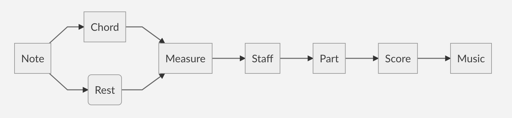

# Pitchr
A python library and framework for composing music.

# Writing music documentation

## Note() class

**Init**:

- `pitch`

- `duration`

- `dynamic (piano, forte, crescendo)`

- `articulation (staccato, accent, fermata)`

## Usage

### Note()
    import music
    note1 = music.Note(Pitch(), 1, "forte")
    note1.note() # C-4
    note1.duration() # 1
    note1.dynamic() # "forte"
    note1.augment() or note1.diminsh()

### Building chords

    chord1 = music.Chord([note1, note2])
    chord1.determine() # "Major third"

### Measure(), a collection of notes

    measure1 = music.Measure([note1, note2])
    measure1.contains(note1) # True
    measure1.append(note3)

### Staff(), a collection of measures

**Init**:
- `clef`
- `voice`
- `measures`

`staff1 = music.Staff(Clef.TREBLE, Voice.PIANO, measure1)`

### Part(), a collection of staffs

    part1 = music.Part(staff1, tempo, time_signature, key_signature)
    part1.add_staff(staff2)
    part1.time_signature = 3/4

### Score()

    score1 = music.Score("My Song", "Wonderful Subtitle", "Author Me", "me@email.com")
    score1.get_author() # "Author Me"
    score1.get_title() # "My Song"
    score1.add_part(part1)

# Contributing
### Setting up dependencies
* To create the virtual environment, `cd` into the project directory and `python3 -m venv env`
* To install dependencies to the virtual environment, `source env/bin/activate && pip3 install -r requirements.txt`
* Install these dependencies using your local package manager (ex. `sudo apt install python3-dev`):
  * `python3-dev`
  * `libasound2`

### Working on the project
* Before working, activate the environment by `source env/bin/activate`
* Deactivate by `deactivate`
